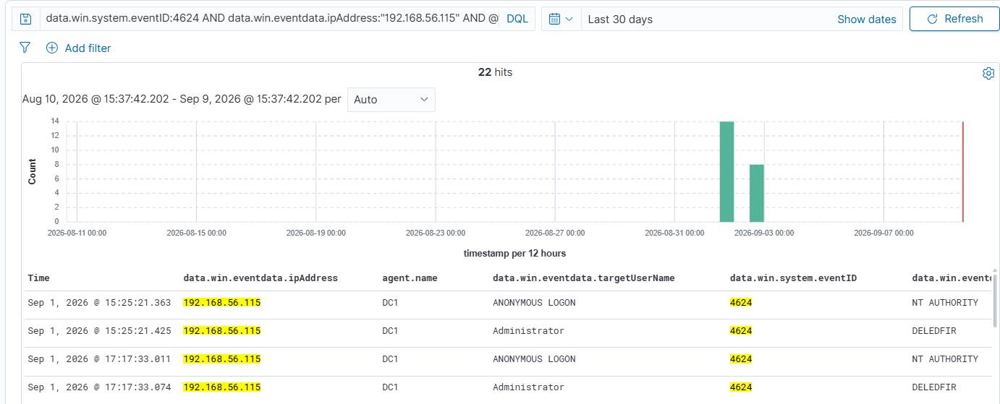
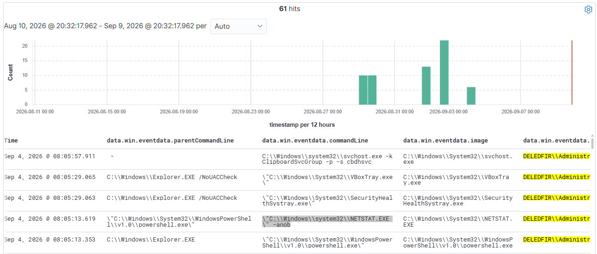

# AD-IAM-Wazuh-Investigation

## Overview

This project documents a hands-on Active Directory and IAM security investigation in a Wazuh-monitored lab environment. The scenario simulates a privileged-account compromise of `DELEDFIR\Administrator`, beginning with NTLM-based network authentication from an attacker host and progressing through post-authentication execution, user and network discovery, and potential defense evasion through Sysmon reconfiguration.

Using Wazuh and Sysmon telemetry, the investigation reconstructs the attack timeline, maps observed behaviors to MITRE ATT&CK tactics, identifies indicators of compromise, and scopes affected systems. The findings provide actionable recommendations for containment, remediation, and hardening, demonstrating how SOC teams can respond to credential-based threats in an enterprise environment.

# INVESTIGATION REPORT

| Field Name          | Value                                                           |
|---------------------|-----------------------------------------------------------------|
| **Date Of Report**  | 2026-09-10                                                      |
| **Reported By**     | DeleDFIR                                                        |
| **Security Level**  | High                                                            |
| **Report Status**   | Open - containment and credential rotation required immediately |
| **Escalated To**    | SOC Lead / Security Team                                        |

---

## Executive Summary

- **Incident overview:** A successful NTLM-based network authentication was detected against the domain controller using the privileged `DELEDFIR\Administrator` account from the simulated attacker host `192.168.56.115`. Subsequent Wazuh/Sysmon telemetry showed repeated Administrator PowerShell, command-shell, WMI, Sysmon reconfiguration, file-creation, named-pipe, and network-enumeration activity across DC1 and WS01.

- **Impact:** Privileged Administrator account compromise with post-authentication execution, discovery activity, activity observed on both DC1 and WS01, and potential defense evasion through Sysmon reconfiguration.

- **Risk:** High

- **Status:** Persistence remains viable until removed

- **Required action:** Preserve evidence; isolate the attacker source; reset/rotate compromised privileged credentials; remediate any identified Sysmon configuration changes; and begin estate-wide IOC scoping.

---

## Findings

### Initial Access — Valid Accounts

On September 1, 2026 at 15:25:21 UTC, `DELEDFIR\Administrator` successfully authenticated to DC1 from `192.168.56.115` using NTLM with Logon Type 3 (network logon). No RDP activity was identified from this authentication event.

### Confirmed Privileged-Account Compromise and Post-Authentication Activity

Post-authentication Sysmon telemetry showed repeated Administrator activity including PowerShell, WMI-driven `whoami`, command-shell execution, and network enumeration. This establishes activity after the successful privileged authentication.

### Persistence

No persistence mechanism was conclusively confirmed; no confirmed file drop or Guest-account login was observed, while Sysmon reconfiguration represents potential defense evasion.

### Hands-on Post-Authentication Activity Observed

The investigation identified repeated privileged-user execution across DC1 and WS01, including PowerShell and command-shell activity, WMI-based user discovery, Sysmon reconfiguration with correlated registry changes (Events 12 and 13), file-creation and named-pipe telemetry, and network/process discovery using `NETSTAT -anob`.

`Event IDs` 7, 11, 17, 26, and 29 were reviewed as supporting telemetry; no confirmed malicious DLL load, attacker-dropped payload, or persistence mechanism was established from these events, and Event ID 3 returned no Administrator results.

---

## Investigation Timeline

| Time (UTC)                    | Event                                                                                                                                             |
|-------------------------------|---------------------------------------------------------------------------------------------------------------------------------------------------|
| **Sep 1, 2026 15:25:21**      | `DELEDFIR\Administrator` successfully authenticated to DC1 from `192.168.56.115` using NTLM, Logon Type 3.                                        |
| **Sep 1, 2026 17:12:56.743**  | Administrator launched PowerShell on DC1.                                                                                                         |
| **Sep 1, 2026 17:21:14.790**  | `WmiPrvSE` spawned `cmd.exe` to execute `whoami` on DC1.                                                                                          |
| **Sep 1, 2026 17:21:14.821**  | `cmd.exe` executed `whoami` on DC1.                                                                                                               |
| **Sep 1, 2026 17:25:44.520**  | Administrator launched `cmd.exe` from Explorer on DC1.                                                                                            |
| **Sep 2, 2026 15:24:19.621**  | Administrator launched PowerShell from Explorer on DC1.                                                                                           |
| **Sep 2, 2026 15:59:29.036**  | Administrator launched PowerShell on WS01.                                                                                                        |
| **Sep 2, 2026 17:45:30.546**  | Administrator used PowerShell to execute `Sysmon64.exe` with `sysmonconfig.xml`, indicating Sysmon reconfiguration activity.                      |
| **Sep 2, 2026 17:45:30**      | Sysmon Events 12 and 13 recorded registry changes associated with the Sysmon reconfiguration.                                                     |
| **Sep 4, 2026 08:05:13.619**  | Administrator used PowerShell to execute `NETSTAT.EXE -anob` on WS01, enumerating network connections, listening ports, and associated processes. |
| **Sep 4, 2026 08:05:13.619**  | Last Sysmon activity observed from Administrator.                                                                                                 |

---

## Who, What, When, Where, Why, How

- **Who:** `DELEDFIR\Administrator` account, originating from the simulated attacker host `192.168.56.115`.

- **What:** Successful privileged authentication followed by PowerShell, command-shell, WMI-based user discovery, Sysmon reconfiguration, and network/process discovery activity.

- **When:** Initial authentication occurred Sep 1, 2026 @ 15:25:21 UTC; subsequent activity continued through Sep 4, 2026 @ 08:05:13.619 UTC.

- **Where:** `DC1.DeleDFIR.local` and `WS01.DeleDFIR.local`.

- **Why:** The exact attacker objective is unknown; observed activity is consistent with post-compromise execution, discovery, and potential defense evasion.

- **How:** The Administrator account authenticated using NTLM Logon Type 3, after which Sysmon recorded the subsequent process and supporting telemetry.

---

## MITRE ATT&CK Techniques

| Tactic               | Technique                                                                            |
|----------------------|--------------------------------------------------------------------------------------|
| **Initial Access**   | T1078 — Valid Accounts                                                               |
| **Execution**        | T1059.001 — PowerShell; T1059.003 — Windows Command Shell                            |
| **Discovery**        | T1033 — System Owner/User Discovery; T1049 — System Network Connections Discovery    |
| **Defense Evasion**  | T1562.001 — Impair Defenses: Disable or Modify Tools                                 |

---

## Recommendations / Next Steps

### Immediate — Contain & Preserve

1. Isolate the simulated attacker source `192.168.56.115` from the lab environment.
2. Preserve Wazuh alerts, Windows Security events, Sysmon events, process telemetry, and relevant logs before cleanup.
3. Reset/rotate the affected `DELEDFIR\Administrator` credentials and review active privileged sessions.

### Persistence Removal

1. Verify whether the `Administrator` or `Guest` accounts, scheduled tasks, services, registry autoruns, or other persistence mechanisms were modified.
2. Review DC1 and WS01 for additional tools, files, services, or artifacts associated with the observed activity.

### Scoping

1. Hunt `DELEDFIR\Administrator` authentication and process activity across all monitored endpoints.
2. Search for source IP `192.168.56.115` across Wazuh telemetry.
3. Hunt for `Sysmon64.exe`, `sysmonconfig.xml`, unusual PowerShell execution, and related registry modifications.
4. Review DC1 and WS01 independently because Administrator activity was observed on both systems.
5. Determine whether any additional systems received authentication or process activity from `192.168.56.115`.

### Hardening / Preventive Controls

1. Restrict exposure of domain controllers and administrative interfaces.
2. Enforce strong privileged-account controls and MFA where applicable.
3. Reduce unnecessary use of highly privileged accounts.
4. Protect Sysmon configuration and alert on unauthorized configuration changes.
5. Improve detection for privileged-account authentication followed by discovery or potential defense-evasion activity.

---

## IOCs

| Type             | Value                                                                  |
|------------------|------------------------------------------------------------------------|
| **Source IP**    | `192.168.56.115`                                                       |
| **Accounts**     | `DELEDFIR\Administrator`                                               |
| **Hosts**        | `DC1.DeleDFIR.local`, `WS01.DeleDFIR.local`                            |
| **Processes**    | `powershell.exe`, `cmd.exe`, `WmiPrvSE`, `Sysmon64.exe`, `NETSTAT.EXE` |
| **Files**        | `Sysmon64.exe`, `sysmonconfig.xml`                                     |
| **Commands**     | `whoami`, `NETSTAT.EXE -anob`                                          |
| **Registry**     | Sysmon Events 12/13 — reconfiguration activity                         |
| **Named Pipe**   | Sysmon Event 17 — PowerShell activity                                  |

---

## Appendix

### Evidence

### OSINT Activities

- The source IP `192.168.56.115` was a simulated private lab attacker address; external reputation services such as AbuseIPDB were not applicable.